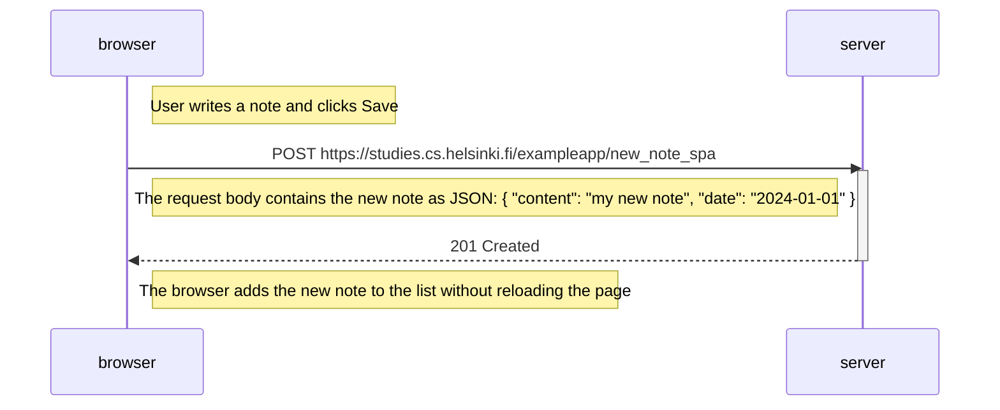

```mermaid
sequenceDiagram
    participant browser
    participant server

    Note right of browser: User writes a note and clicks Save

    browser->>server: POST https://studies.cs.helsinki.fi/exampleapp/new_note_spa
    activate server
    Note right of browser: The request body contains the new note as JSON: { "content": "my new note", "date": "2024-01-01" }
    server-->>browser: 201 Created
    deactivate server

    Note right of browser: The browser adds the new note to the list without reloading the page 
```

